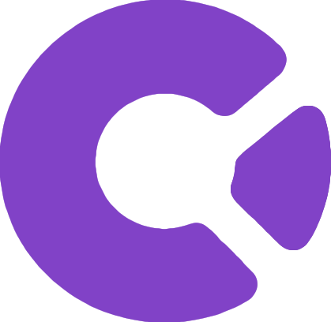

<p align="center">
  
</p>

<h1 align="center">Codr</h1>

<p align="center">
  A desktop chat UI for the Claude Agent SDK with remote web access
</p>

<p align="center">
  <a href="https://github.com/qrcf/codr/releases"></a>
  <a href="LICENSE"></a>
  
  
</p>

<!-- TODO: Add a screenshot of the chat UI showing a conversation with tool calls visible -->
<!-- Save it to docs/screenshot.png and uncomment the line below -->
<!-- <p align="center"></p> -->

## Features

- **Agent chat UI** — Full chat interface for Claude Agent SDK sessions with streaming responses, thinking visualization, and context usage tracking
- **Multi-provider runtime** — Switch between Claude (Agent SDK) and Codex (Codex SDK) without changing workflows
- **Remote web access** — Companion web client connects to your desktop session through a relay server, sharing the same React UI
- **Tool call rendering** — Dedicated display components for Bash, Edit, Read, Write, Glob, Grep, and more, with diff previews for file modifications
- **Documentation ingestion** — Crawl websites into searchable doc sources, then reference them in prompts with `@docs:SourceName`
- **File references** — Mention files with `@path/to/file` to inject their contents into prompt context
- **Permission controls** — Granular tool approval system with auto-approved reads, gated writes, and configurable bash whitelists
- **Plan mode** — Structured planning workflow where the agent drafts a plan for your review before executing
- **Session management** — Persistent session history with search, archiving, and project-based grouping
- **Auto-updates** — Built-in update mechanism via electron-updater

## Installation

### Download

Grab the latest build from [GitHub Releases](https://github.com/qrcf/codr/releases):

| Platform | Format |
|----------|--------|
| macOS (Apple Silicon & Intel) | `.dmg` |
| Linux (x64 & arm64) | `.AppImage`, `.deb` |
| Windows (x64) | `.exe` installer |

### Build from Source

Prerequisites:
- [Node.js 22](https://nodejs.org/) (see `.nvmrc`)
- [pnpm](https://pnpm.io/)

```bash
git clone https://github.com/qrcf/codr.git
cd codr
pnpm install
pnpm dev
```

You'll need a `.env` file before running — see [Environment](#environment) below.

## Environment

Create a `.env` file in the project root:

```bash
VITE_CLERK_PUBLISHABLE_KEY=...      # Clerk authentication key
VITE_RELAY_URL=ws://localhost:8080   # WebSocket relay server
VITE_WEB_URL=http://localhost:5174   # Web client URL
```

The relay server is an external service not included in this repository. For local development, you'll need access to a running relay instance.

For production builds, additional signing and notarization credentials are required — see the [CI workflow](.github/workflows/release.yml) for details.

## Development

| Command | Description |
|---------|-------------|
| `pnpm dev` | Run Electron app with HMR |
| `pnpm build` | Production build (electron-vite) |
| `pnpm dist` | Package for current platform |
| `pnpm lint` | Run ESLint |
| `pnpm web:dev` | Start companion web client (port 5174) |
| `pnpm web:build` | Build web client for production |
| `pnpm deploy --upload` | Build, version bump, package, publish to GitHub Releases |

## Architecture

Codr is an Electron app with three processes:

- **Main** (`src/main/`) — Agent runtime, permissions, session management, relay client
- **Preload** (`src/preload/`) — Context bridge exposing `window.claude` API
- **Renderer** (`src/renderer/`) — React chat UI, shared with the web client

The companion web client (`packages/web/`) reuses the same React components via path aliases, implementing `window.claude` over WebSocket instead of Electron IPC.

```
User input → App.tsx → window.claude.query()
  → [Electron IPC | WebSocket relay]
  → Main process → Provider (Claude SDK / Codex SDK)
  → Streaming response → Event broadcaster
  → [IPC to renderer] + [Relay to web clients]
```

For detailed architecture documentation, see [CLAUDE.md](CLAUDE.md).

## Project Structure

```
codr/
├── src/
│   ├── main/           # Electron main process + agent runtime
│   ├── preload/        # Context bridge (window.claude API)
│   └── renderer/       # React UI (components, hooks, renderers)
├── packages/
│   └── web/            # Companion web client (Clerk + WebSocket)
├── scripts/            # Build and deploy tooling
├── resources/          # Python runtime, crawl4ai worker
└── build/              # Packaging assets (icons, entitlements)
```

## Tech Stack

| Layer | Technology |
|-------|------------|
| Framework | Electron 41, electron-vite |
| UI | React 19, Tailwind CSS 4 |
| Language | TypeScript |
| Agent SDKs | Claude Agent SDK, Codex SDK |
| Auth | Clerk |
| Docs crawling | crawl4ai (Python), uv |
| Build | electron-builder, Vite, pnpm workspaces |
| CI/CD | GitHub Actions, Vercel |

## Contributing

Contributions are welcome! Since this is an early-stage project, here are some guidelines:

1. **Open an issue first** for non-trivial changes to discuss the approach
2. **Fork and branch** — create a feature branch from `main`
3. **Follow existing patterns** — see [CLAUDE.md](CLAUDE.md) for architecture conventions
4. **Lint before submitting** — run `pnpm lint` and fix any issues
5. **No test suite yet** — validation is done through linting and manual testing

### Areas where help is welcome

- Test infrastructure
- Documentation improvements
- Tool renderer components for additional tools
- Accessibility improvements

## Known Limitations

- **No test suite** — The project relies on linting and manual testing.
- **External relay required** — The relay server for web client connectivity is not included in this repo.
- **Early stage** — APIs and architecture may change between versions.

## License

[MIT](LICENSE) — Quinn Finney, 2025
